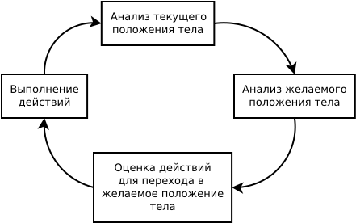
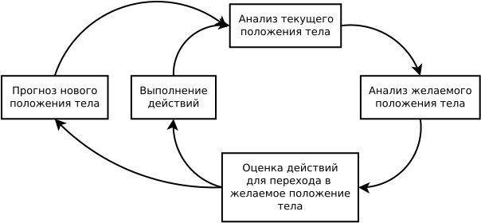

## Общие вопросы уравлением движением

Насколько известно автору, в доступной литературе данный вопрос полностью не раскрыт. Сразу хотелось бы оговориться, что тема эта сложная и автор в ней никоим образом не специалист, потому нижеследующий текст это скорее изложение теории ещё требующей доказательств.

Общепризнанным является мнение, что с биологической точки зрения нервная система вообще, и головной мозг в частности, это в первую очередь инструмент адаптации животных и человека. То есть, нервная система предназначена для того, чтобы её обладатели имели возможность более эффективно подстраиваться под изменения окружающей среды.
В ряде случаев такая адаптация носит опережающий характер, то есть, происходит ещё до того, как эти изменения наступили.
Одна из теорий интеллекта, как явления высшей нервной деятельности, вообще полагает способность делать прогнозы его главной отличительной чертой и мерой. Данная точка зрения изложена в книге "Об интеллекте" Джеффа Хокинса.

Представляется разумным применить этот подход и к управлению движением. Сейчас мы не будем рассматривать высокоуровневые аспекты мировоззрения, стратегии, тактики и целеполагания, а также такие низкоуровневые вопросы как передачу нервного импульса, а ограничимся тем, как головной мозг изыскивает способы достичь конкретной цели движения (например, нанести удар по корпусу противника), а также тем, как он адаптируется к происходящим изменениям.

Рассмотрим самую примитивную схему управления движением тела:

Перед любым управляемым движением необходимо получить сведения о текущем положении тела просто потому, что от этого зависит выдача правильных команд на переход в нужное положение. Это делается путём опроса состояния мышц и, главное, положения суставов. В каком-то роде данная задача похожа на получение координат всех значимых объектов на местности методом теодолитного хода путём многократной триангуляции.

Далее необходимо понять, какое желаемое положение тела будет отвечать решению той или иной задачи (вопрос постановки этой задачи мы сейчас сознательно опускаем). Кстати, для того, чтобы чётко себе представлять, какие положения возможны, требуется постоянная калибровка путём тренировок. Обобщая можно сказать, что система управления должна очень хорошо знать возможности исполняющей части.

Только после этого можно понять, какие перемещения в пространстве должны выполнить те или иные части тела.

Далее следует само действие, после чего цикл повторяется для внесения поправок на устанение неизбежных неточностей или для достижения новых целей.

Естественно, в действительности всё несколько сложнее. Вместо положения тела почти всегда речь идёт о положении тела плюс скоростях его частей (и это ещё без учёта действий противника). То есть, мы рассчитываем как из текущего положения и уже имеющихся движений тела или его звеньев в данный момент перейти в желаемое положение с желаемыми скоростями звеньев. Понятно, что даже в таком виде с учётом всех степеней свободы тела задача довольно сложная, а значит, и ресурсоёмкая.

Тут надо сделать небольшое отступление. Наша нервная система крайне требовательна к питательным веществам и своевременности их поступления. Головной мозг способен потреблять очень много глюкозы и кислорода, особенно с учётом его небольшой массы по отношению ко всему телу. Он же первым начинает разрушаться при гипоксии (недостатке кислорода). Считается, что при прекращении дыхания уже через несколько минут в головном мозге происходят необратимые изменения. При этом, мышцы, например, способны без особого вреда продержаться на порядок дольше.
Мало того, в результате эволюции так получилось, что наша нервная система фактически является нашему телу чужеродным органом. Если имунная система вступает в контакт с нервной системой, она её атакует, что ведёт к гибели организма в целом. Чтобы этого не произошло, головной мозг отделён от кровотока так называемым гемато-энцефалическим барьером. Этот барьер защищает мозг от остального организма и выступает посредником при обмене питательными веществами и продуктами жизнедеятельности. Такое положение вещей дополнительно усугубляет проблемы возникающие при решении сложных двигательных задач. Субъективно мы не замечаем насколько сложно бывает подготовить то или иное движение (поскольку делаем это постоянно и зачастую неосознанно), однако, если обращать на это внимание то окажется, что прохождение по этому кругу (даже без учёта выполнения физического движения) занимает от долей до нескольких секунд. Если данные задачи решаются нерационально, то, помимо временных затрат, быстро наступает утомление нервной системы, вызванное, по видимому, ограниченной возможностью питания нервных клеток.

Можно ли что-то сделать для сокращения этого времени и увеличения КПД управления? Попытаемся выделить несколько направлений:

1) Такое построение управляющих воздействий, когда высшие отделы мозга передают работу низшим специализированным отделам. Высшие отделы в целом более сложно организованы, а значит и более требовательны к ресурсам и быстрее утомляются.
Такое делегирование достигается тренировкой. Сначала сложные движения полностью контролируются высшими отделами (в общем виде это называется "режим ручного управления"), но в процессе освоения контроль за данными движениями "спускается вниз". Подходящий пример из сферы управления автомобилем это контроль дистанции. Сначала на это действие уходит очень много внимания, а значит и сил, но со временем те же самые функции начинают выполняться менее высокоорганизованными отделами (и при этом, не хуже), а вниманию можно дать отдых или направить на что-то ещё. Полностью аналогична ситуация с удержанием выгодной дистанции до противника.

2) Избегание конфликтов между отделами. Наш мозг не однороден, его не вполне верно сравнивать с процессором домашних ЭВМ. Скорее это как органы власти в государстве. Грубо говоря, есть президент (сознание), есть разные разведки (органы чувств), есть министры, у каждого своё специализированное министерство (отделы мозга), между ними специфические связи и в каждом из них своя иерархия. Кстати, возвращаясь к предыдущему пункту, в рамках нашей модели хорошо бы, чтобы проблемы решались на местном уровне, без обращения к "президенту" на "прямой линии" -- сознание не может контролировать каждое движение в теле, и каждый происходящий процесс. Так вот, если какая-то команда сверху вступит в противоречие с "желанием" промежуточных звеньев (от министерств до конкретных исполнителей на местах), то она не будет выполнена, или будет выполнена не так, как надо. Например, вы собираетесь руками снять кастрюлю с плиты забыв, что она горячая. Со стопроцентной вероятностью можно предсказать, что рука будет отдёрнута после касания. Так рефлекс, реализуемый спинным мозгом, перехватил управление и помешал выполнению движения заданного сознанием. В боевых искусствах самый частый пример подобного конфликта это неожиданная потеря равновесия -- все движения будут забыты, а тело займётся восстановлением равновесия или смягчением падения. Но у этого есть и другая сторона: если удаётся создать подобный конфликт у противника, возможность его противодействия будет сильно ограничена.

3) Построение движения таким образом, чтобы максимально сохранить некие общие механические параметры системы и, таким образом, на каждом этапе схемы вносить небольшие поправки к предыдущим значениям вместо того, чтобы считать их заново. Это кратно сокращает время и дефицитный запас работоспособности нервной системы на адаптацию к новым условиям. Давайте ещё раз сравним свободные движения без компенсации и с компенсацией, но на этот раз обратим внимание не на механический аспект, а на управленческий:

<video width="640" height="360" controls>
	<source src="../data/compensation-rot-bad.mp4" type="video/mp4">
	Ваш браузер не поддерживает видео html5 в формате mp4
</video>
<video width="640" height="360" controls>
	<source src="../data/compensation-rot-good.mp4" type="video/mp4">
	Ваш браузер не поддерживает видео html5 в формате mp4
</video>

Теперь представим, что средний луч также применяется для целеуказания, как и боковые, и до начала движения прямо вдоль него подготовлен и нацелен ещё один удар. Через долю секунды от начала движения в первом случае придётся перенацеливаться по сложному закону, а во втором в течение некоторого времени (малого лишь вследствии несовершенства данное модели, как мы уже отмечали) можно нанести точный удар без перерасчёта.
Конечно, в обоих случаях взаиморасположение звеньев объекта менялось, однако, при выполнении действий определённым образом, ситуация после выполнения движения будет во многом похожа на ситуацию до него, что позволить пройти по управляющему циклу гораздо быстрее и легче.

4) Представим себе, что мы выполняем сложное движение, которое очень существенно меняет параметры положения тела. Что тогда происходит? Вначале мы упоминали такое свойство нервной системы, как способность делать прогнозы. На самом деле, цикл управления в большинстве ситуаций выглядит несколько сложнее:

Выполняя какое-либо физическое действие мы всегда точно чувствуем, где окажемся после этого, и какие там будут ощущения. Если это будет не так, то время на оценку ситуации и текущего положения тела существенно увеличивается -- происходит своего рода кратковременный ступор. Данный строна управления движением очень хорошо раскрыта в вышеупомянутой книге "Об интеллекте". Опять же, в реальности работа схемы существенно сложнее, и, скажем так, текущее состояние управления размазано по ней относительно равномерно. То есть, мы постоянно двигаемся, одновременно меняем цели движения, одновременно оцениваем текущие механические параметры тела и одновременно строим прогнозы наших будущих положений тела, откуда готовим движения ещё до того, как мы в этом положении оказались. Отсюда можно вывести ещё один принцип управления движением: надо двигаться предсказуемо для себя (и непредсказуемо для противника). В качестве иллюстрации данного тезиса можно привести тот факт, что люди, которых сильно укачивает, когда они едут пассажирами автомобиля, зачастую совершенно нормально себя чувствуют сидя за рулём, даже если в целом ездят менее плавно.

Программа, которая использовалась для создания моделей позволяет делать это только в двумерном пространстве, где для каждого твёрдого тела возможны две поступательные и одна вращательная степень свободы; однако даже глядя на модели со свободным вращением не так легко почувствовать и спрогнозировать движения тел. В нашем трёхмерном мире у объёмного твёрдого тела поступательных степеней три и вращательных тоже три. Пока ограничимся твёрдым телом, для простоты. Так вот, свободные поступательные движения легко прогнозируются и легко просчитываются (если тело движется поступательно, и на него не действуют силы, мы быстро приобретём почти физическое ощущение его траектории). С вращательными уже сложнее. У каждого твёрдого тела есть минимум три оси, вокруг которых оно может свободно вращаться (правда, в ряде случаев это вращение метастабильно). У симметричных тел таких осей может быть больше, но в случае с человеческим телом в произвольной позе их почти всегда не более трёх.
Так вот, если мы делаем вращательное движение вокруг одной из таких осей, то в целом есть возможность таким движением управлять и его предсказывать в ощущениях -- яркий пример это быстрое и стабильное вращение фигуристов.

Вот, например, фрагмент выступления фигуристки Юлии Липницкой на олимпиаде в Сочи: 
<iframe width="640" height="360" src="https://www.youtube.com/embed/5sH1-HgS3vg?start=231&end=251" frameborder="0" allow="autoplay; encrypted-media" allowfullscreen></iframe>

А вот если мы запустили движение, которое является вращательным, но ось такого вращения не соответствует одной из главных центральных осей инерции, то даже для твёрдого тела, на которые более не действуют никакие внешние силы, такое вращение будет крайне труднопредсказуемым [[ кадры из фильмов гравитация/союз-17/фильм про космос и звезду-чёрную дыру]].
Как видно, в таком случае просчитать что-либо практически невозможно, даже если глядеть на это со стороны. Однако, когда мы сами так двигаемся, то мы оказываемся внутри, и наш вестибулярный аппарат, при этом, посылает в мозг практически хаотичные сигналы. Ситуация усугубляется тем, что в отличие от твёрдого тела у нас гораздо больше степеней свободы, и при таком вращении на каждое звено тела будут постоянно действовать центробежные силы не совпадающие для разных частей тела и меняющие своё направление и значение по труднопредсказуемому закону -- что означает, что даже для сохранения взаиморасположения частей тела надо к каждой части тела прикладывать силу меняющуюся по тому же закону. Конечно, таких скоростей как у профессиональных фигуристов достичь будет проблематично (тем более для несбалансированного вращения), однако, поспольку каждая часть тела подвергается такому переменному воздействию, даже относительно медленное несбалансированное движение тела крайне осложняет управление им.

В общем, движения следует строить таким образом, чтобы максимально упростить себе прогноз положения тела: проще всего, если вращения тела в целом вообще нет, что достигается правильными скомпенсированными движениями. Если же вы создаёте вращательное движение, то следует делать это так, чтобы оно было сбалансированно, то есть, происходило относительно одной из главных центральных осей инерции. При перестроении тела будут поворачиваться и эти оси сами по себе, это тоже надо учитывать.

С другой стороны, следует, тренировать свои возможности по управлению всё более сложными движениями, работая сначала без перемещения цели, потом с её относительными движением, потом с собственным вращением и так далее. В принципе, в некоторых случаях можно научиться управлять и произвольными несбалансированными движениями, однако, полезность такой тренировки пока под вопросом.
