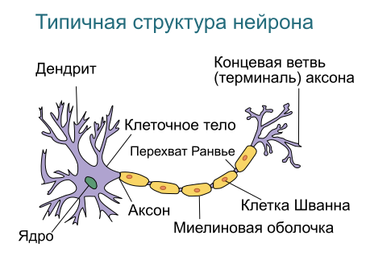
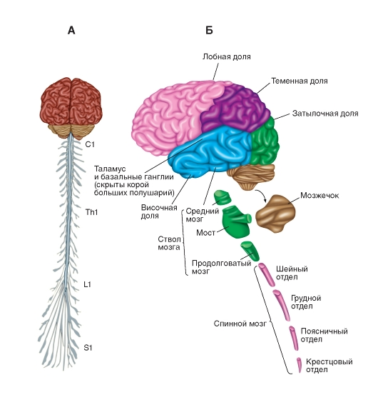
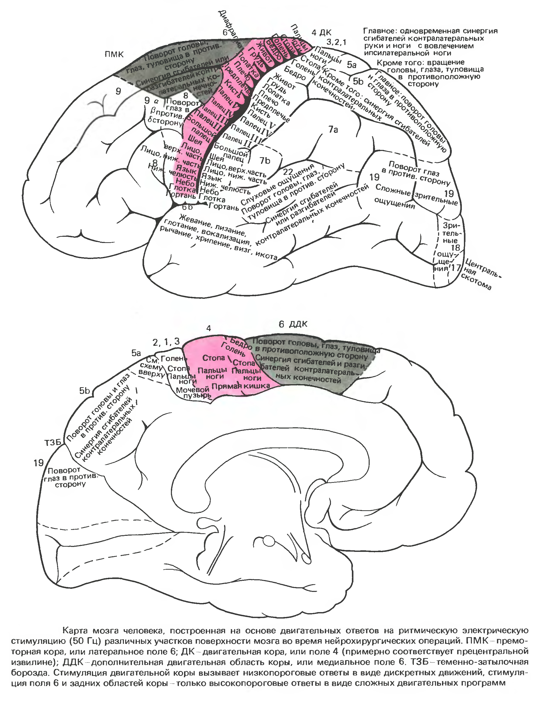

[К оглавлению](../)

# Нейрофизиология управления движением

Данная статья представляет собой краткий конспект Главы 5. "Двигательные системы" учебника  __\[Р. Шмидт, Г. Тевс, Физиология человека, Том 1. 2005\]__ дополненный из других источников. Мысли и соображения, добавленные автором от себя помечены _явными образом_. Автор не является специалистом в вопросе нейрофизиологии, поэтому его мысли следует воспринимать скорее как информацию к размышлению.

Забегая вперёд об организации отвечающих за движение частей нервной системы можно сказать следующее: прослеживается структурная и функциональная иерархия. В то же время каждый отдел имеет и некоторую самостоятельность, позволяющую ему управляют теми или иными движениями или статическими положениями без непосредственного контроля вышестоящих отделов. 

Центральная нервная система в целом, как и любая другая структура для обработки информации, имеет входы и выходы. Входы это наши органы чувств, Выходы, применительно к нашей теме, это мышцы. В ряде случаев на одни и те же состояния входов (раздражители) у разных животных, включая людей, присутствует одинаковые реакции. Автоматическая, стереотипная, целенаправленная реакция организма на стимул называется рефлексом. Рефлексы принято делить на врождённые (безусловные по Павлову) и условные; первые присущи организму по факту рождения, вторые являются результатом научения. Надо отметить, что по крайней мере некоторые рефлексы, даже врождённые, можно "перепрограммировать" на прямо противоположные путём тренировок.

С другой стороны, центральная нервная система, даже самые её нижние отделы, находящиеся в спинном мозге, способны и к периодическим двигательным актам безо всяких внешних стимулов. Такие движения называют автоматическими. Примером автоматического движения являются ходьба, дыхание. _Что интересно, по наблюдению автора, когда мы обращаем внимание на эти движения, они перестают быть автоматическими и начинают управляться более высшими двигательными отделами - к этому предположению мы ещё вернёмся далее_.

Ещё одной из граней функционального разнообразия является разделение на позные и целенаправленные функции. Первые предназначены для поддержания положения тела в пространстве, вторые для действий, подразумевающих изменение положения тела. При этом, эти две функции тесно связаны. В обычной жизни в подавляющем большинстве случаев мы делаем движения только некоторыми частями тела, а не всеми сразу: во время ходьбы положение спины не меняется, при наборе текста на клавиатуре или письме ручкой двигаются только кисти и пальцы. Более того, по результатам исследований даже перемещение центра тяжести при дыхании активирует ряд мышц для поддержания изменившегося равновесия. _Разумно предположить (по мнению автора), что при выполнении тех или иных движений, затрагивающих только часть тела, требуется активное управление позой для её поддержания, так как в любом случае меняется нагрузка на прочие мышцы тела, даже если они непосредственно не создают движения; иными словами, чтобы часть тела могла двигаться, другая часть (при её позном контроле) должна обеспечить это движение_. К этому вопросу мы ещё вернёмся ниже.

Пару слов о нервных клетках -- нейронах, из которых состоит наша нервная система. Их насчитывается множество видов, но мы очень упрощённо рассмотрим некий обобщённый нейрон и взглянем на него с точки зрения теории информации. 

(изображение с сайта [википедии](https://ru.wikipedia.org/wiki/%D0%9D%D0%B5%D0%B9%D1%80%D0%BE%D0%BD))

Число нейронов в нервной системе человека оценивается в 100 миллиардов, количество связей одного нейрона с другими может достигать 100 тысяч. Нейроны обмениваются друг с другом импульсами, которые представляют собой поперечную электрохимическую волну изменения заряда поляризации нервного волокна. Скорость его распространения в среднем составляет несколько десятков метров в секунду. С математической точки зрения нейрон реализует некую функцию от всех своих входов (синаптических контактов) на теле клетки и её дендритах. Результатом обработки является определённое состояние возбуждения нейрона, которое передаётся по аксону далее. Чем больше возбуждён нейрон, тем с большей частотой он посылает нервные импульсы по аксону.

Теперь посмотрим как двигательная часть нервной системы обрабатывает информацию начиная с её самых простых и эволюционно древних отделов и заканчивая высшими. Ниже представлена сильно упрощённая схема отделов, содержащая интересующие нас части: 

(источник изображения __\[А. Г. Камкин, И. С. Киселева, Атлас по физиологии, том 1. 2010\]__)

Итак, у нас в мышцах есть рецепторы ("датчики") растяжения, которые представляют собой особые мышечные волокна обвитые нервными окончаниями и реагирующие на изменение длины волокна. Эти рецепторы  называют мышечные веретена. Помимо этого, в сухожилиях есть рецепторы силы натяжения (так называемые органы Гольджи), которые представляют собой нервные окончания ветвящиеся среди сухожильных нитей. А в наших суставах присутствует множество чувствительных рецепторов, сообщающих об углах их раскрытия и поворота.

Теперь поговорим о том, как происходит управление мышцами. Как мы упоминали выше, у каждого двигательного отдела ЦНС есть некоторая самостоятельность.
Например, ряд рефлексов осуществляются в спинном мозге, а некоторые из них, такие как рефлекс растяжения мышцы, тот самый, который проверяют врачи неврологи ударом молоточка по связке под коленом, управляются моносинаптическими (имеющими всего одно синаптическое переключеие) рефлекторными дугами проходящими всего через два нейрона. Что интересно, это один из самых быстрых рефлексов, его время 20-25 миллисекунд, причём 3 из них это время прохождения сигнала непосредственно между двумя нейронами -- так называемое центральное время рефлекса. Помимо прочего роль данного рефлекса заключается в том, чтобы поддерживать постоянные длины мышц, что важно для поддержания позы. В принципе, используя этот и другие рефлексы, спинной мозг сам без контроля сверху способен поддерживать позу и даже стояние животных, реагируя на столь малые изменения длин мышц, что они не заметны невооружённым взглядом. Более сложные рефлекторные дуги включают в себя по несколько нейронов и отвечают за синхронное изменение тонуса пар мышц антагонистов конечностей и даже за координацию напряжения мышц разных конечностей. Кроме того, спинной мозг реализует ряд рефлексов, которые в нормальном состоянии подавлены и проявляются только при разрушении связи с вышестоящими отделами. Ещё раз напомним, что помимо выполнения команд сверху и управления рефлексами спинной мозг (особенно изолированный) сам по себе способен на совершение автоматических двигательных актов, то есть независимых от внешней стимуляции двигательных программ.

Выше спинного мозга расположен ствол мозга, который отвечает за более сложные позные рефлексы, обеспечение целенаправленных движений и сложные автоматические движения, такие как ходьба.

Примерно на одном уровне управления со стволом мозга расположен мозжечок. Он получает копии управляющих сигналов нисходящих в спинной мозг а также копии сенсорных сигналов восходящих в высшие отделы. Роль мозжечка в целом состоит в координации, подготовке, запуске и остановке движений; ему же принадлежит основная роль в сохранении равновесия и, возможно, баланса движений. Он получает спинальные (исходящие из спинного мозга), вестибулярные, зрительные сигналы, а также связан с корой головного мозга. Мозжечок управляет вестибо-окулярным рефлексом, который нужен для точной стабилизации направления взгляда при поворотах головы. Также он отвечает за возможность научения, то есть, за приобретение ряда условных рефлексов. Считается, что сопоставляя нисходящие и восходящие сигналы мозжечок оценивает точность движения и вносит поправку. _Как предполагает автор, в боевых искусствах это его свойство может иметь негативные стороны: при пластичной работе у многих занимающихся есть склонность увеличивать силу воздействия, если оно не достигло желаемой цели; в итоге вместо того, чтобы изменить направление воздействия неожиданным образом происходит зажим тела и фактически ступор в попытке "продавить" движение. По видимому, по мере тренировок каким-то образом в случае невозможности достижения цели движения в работу должны включаться высшие отделы для решения задачи более сложным образом. Например, в качестве цели движения можно ставить не некое положение тела, а достижение определённой силы воздействия или передачу определённого импульса (что хорошо свяжется с быстрой, полу-ударной работой) -- тогда, по идее, проблемы ступора удастся избежать; однако, не ясно насколько такая работа физиологична, то есть, возможна с присущей нам организацией ЦНС; в любом случае, эта идея нуждается в исследовании и проработке._

В качестве другого варианта обхода вышеозначенной проблемы можно разбить желаемое движение на несколько составных путём вставления промежуточных "точек контроля", тогда проблема "продавливания" будет иметь меньшие масштабы и ЦНС будет легче переключиться на другое движение в случае сопротивления; эта рекомендация проверена и действует вне зависимости от того, в мозжечке источник проблемы, либо где-то ещё.
Среди прочих двигательных функций мозжечка можно отметить участие в управлении сложными двигательными последовательностями, то есть, порядком включения мышц в разных областях тела при выполнении того или иного движения, то есть, опять же, своего рода "статическое" обеспечение движения.

Выше в иерархии расположены так называемые базальные ганглии, двигательная роль которых состоит в переходе от фазы подготовки движения к фазе выполнения. Также работа этого отдела каким-то образом связана с упреждающим контролем, а также с одновременным выполнением двух и более простых движений. Помимо этого известно, что базальные ганглии связаны с сознанием и концентрацией внимания. _Как предполагает автор, внутреннее состояние готовности к быстрому старту атакующих, защитных и прочих движений может реализовываться базальными ганглиями._

Ещё выше располагается кора головного мозга. Её двигательные функции исследованы относительно хорошо, так как она расположена на поверхности мозга прямо под черепной коробкой.

(источник изображения __\[Р. Шмидт, Г. Тевс, Физиология человека, Том 1. 2005\]__ )

Условно двигательные области коры можно разделить на несколько зон: поля 4, 5, 6; поле номер 4 -- называют двигательной корой или первичной моторной областью, она в целом совпадает с прецентральной извилиной; поле номер 6 целиком -- вторичная моторная область, которую делят на: медиальное (ближе к центральной плоскости) поле 6 -- дополнительная двигательная кора, латеральное (дальше от центра) поле номер 6 -- премоторная кора.

Это деление идёт от экспериментов по электрической стимуляции областей коры. Стимуляция поля 4 (двигательной коры) достаточно быстро приводит к сокращениям небольших групп мышц. Ниже представлен так называемый двумерный двигательный гомункулус Пенфилда, который представляет собой изображения частей тела пропорционально представительству их двигательных зон в поле 4:

(изображение с сайта [Wikimedia](https://wikimedia.org))

Стоит уточнить, что вышеприведённая картинка характеризует только поле 4, тогда как за движения отвечают и другие области. Поля 5, 6 требует более сильной и продолжительной стимуляции, которая приводит к сложным интегральным движениям, в том числе затрагивающим несколько конечностей одновременно.

Исследования свидетельствуют о том, что при выполнении произвольных движений пальцев активность нейронов двигательной коры (поля 4) начинается на 50-100 миллисекунд ранее самого движения. Предполагается, что это время требуется на активацию всех задействованных нейронов разных отделов по цепочке до самих мышц. При этом, электрическая активность вторичной моторной коры возникает примерно за 1 секунду до движения.

Что интересно, спинно-мозговые рефлексы усиливаются при выполнении произвольных движений даже не связанных непосредственно со звеньями рефлекса, что, как считается, лежит в основе так называемого приёма Ендрассика. _Как предполагает автор, состояния боевой готовности заранее активируют все двигательные нейроны, что позволяет сократить время физической реакции; конечно, это предположение нуждается в проверке._

Также стоит отметить наличие прямых нервных волокон от двигательной коры головного мозга к спинному мозгу, которые называются пирамидный путь (или пирамидный тракт). Эти пути наше относительно новое эволюционное приобретение, они появляются у млекопитающих и особенно развиты у обезьян и человека. Как показывают эксперименты, они позволяют практически прямое управление тонкой моторикой пальцев рук корой головного мозга. _По предположению автора это объясняет особую роль тонуса пальцев в создании и удержании правильного боевого состояния всего тела._

_Список литературы_

1. _Р. Шмидт, Г. Тевс, Физиология человека, Том 1. 2005_

2. _А. В. Арефьева, Н. Н. Гребнева, Нейрофизиология. 2017_

3. _В. В. Шульговский, Нейрофизиология, 2016_

_Автор: Алексей Казанцев_, 2018

[К оглавлению](../)

<!-- Yandex.Metrika counter -->

<noscript>

</noscript>
<!-- /Yandex.Metrika counter -->
