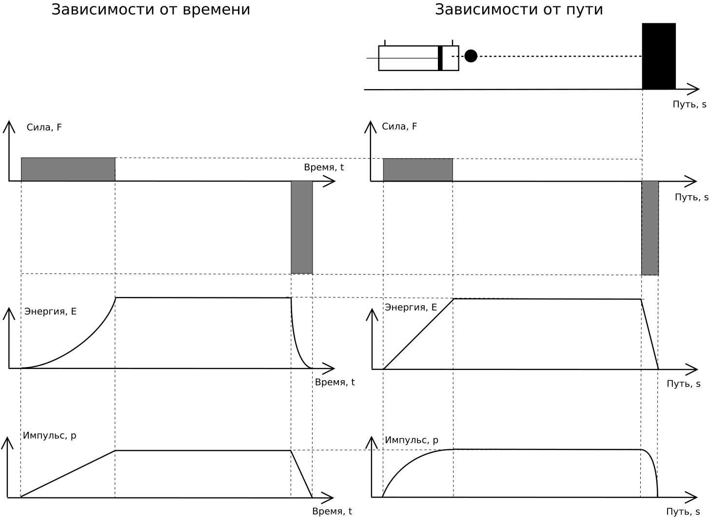

[К оглавлению](../)

# Сила, давление и прочность, удар и толчок, энергия и импульс.

### Введение
Этот текст открывает цикл статей, в котором автор попытается дать естественно-научное объяснение ряду явлений, знакомых любому, кто занимался или продолжает заниматься боевыми искусствами или подвижными видами спорта. В тексте предлагается ряд моделей построенных автором для хорошо знакомых явлений. Основная задача текста: позволить взглянуть с новой стороны на некоторые грани боевых искусств, что может оказать существенную помощь в тренировках за счёт дополнения интуитивно понимаемых знаний знанием осознанным. Автор стремится дать наиболее корректное и точное описание тем или иным явлениям, однако, в конечном итоге оценивать это описание, равно как и адекватность предложенных моделей предстоит читателю. 

Сначала предлагаю провести следующий натурный или умозрительный эксперимент: 
Взять брусок из дерева, положить его на пол и с максимальной силой надавить костяшками кулака, отметить изменения в бруске; после чего взять нож и вертикально вдавить лезвие ножа. В результате окажется, что ножом удалось продавить дерево гораздо глубже и с гораздо меньшими усилиями. А в чём причина такой разницы?

Причина в том, что даже если силы нажатия в обоих случаях были равными, площадь воздействия сильно различалась. На всякий случай следует напомнить, что сила измеряется в ньютонах (Н). С силой один ньютон неподвижный грузик массой около 102 граммов давит на свою опору. А если различались площади воздействия, то различались и давления p=F/S (Па, или Н/(м^2)); давление в 1 Паскаль возникает при давлении силы в 1 Ньютон на площадь в 1 квадратный метр перпендикулярно поверхности, это чуть больше, чем давление одного листа офисной бумаги на стол. Неподвижный грузик массой 1 килограмм давящий на площадь в 1 квадратный сантиметр оказывает давление порядка 100.000 Па, что примерно соответствует давлению атмосферы земли у поверхности. Что интересно, статическая прочность материала также имеет размерность давления. Таким образом, если оказанное давление превышает прочность материала, он разрушается. Увеличивая силу и уменьшая площадь мы можем оказывать воздействие, разрушающее всё более прочные материалы и структуры. Для примера, усреднённые справочные данные по прочности сосны при сжатии вдоль волокон и стали равны, 45.000.000 Па и 500.000.000 Па соответственно.
Необходимо отметить, что нож воздействует на деревянный брусок, то и брусок воздействует на нож c точно таким же давлением, однако, поскольку прочность стали существенно выше прочности дерева, то лезвие ножа при этом не разрушается.
Также надо заметить, что помимо вертикального давления в данном эксперименте существенную роль играет и ряд других факторов, которые, однако, принципиально не меняют общей картины.

Теперь давайте рассмотрим разницу между толчком и ударом. Опять же, интуитивно эта разница многим понятна, однако, чётко сформулировать её может быть затруднительно. В таком случае бывает полезно обратиться к определениям; процитируем статью, посвящённую удару из Большой Советской Энциклопедии: "Удар твёрдых тел, совокупность явлений, возникающих при столкновении движущихся твёрдых тел... Промежуток времени, в течение которого длится Удар, обычно очень мал (на практике от нескольких десятитысячных до миллионных долей сек), а развивающиеся на площадках контакта соударяющихся тел силы (называются ударными или мгновенными) очень велики..."

Можно предложить следующую физическую модель толчка, созданную с помощью физического симулятора Algodoo. _Это видео, как и последующие, можно посмотреть в полноэкранном режиме._
<video width="640" height="360" controls>
	<source src="../data/push.mp4" type="video/mp4">
	Ваш браузер не поддерживает видео html5 в формате mp4
</video> 
Здесь также присутствует график сил, действующих на объект, который изображён красным цветом.

Толчок можно охарактеризовать следующими словами:
- Разгоняющая сила равна силе толчка.
- Действие силы проявляется сразу же без задержки и без необходимости перемещения тел.

Теперь попробуем предложить следующую модель удара:
<video width="640" height="360" controls>
	<source src="../data/kick.mp4" type="video/mp4">
	Ваш браузер не поддерживает видео html5 в формате mp4
</video> 
Обратите внимание на тот факт, что при равной жёсткости пружины и равной степени сжатия сила удара в этом примере на полтора порядка больше, что видно на графике.
При разгоне действие силы во времени порождает импульс силы N=F\*∆t, который сообщается телу. Импульс тела p=mv.
Параллельно с этим действие силы в пространстве создаёт работу силы A=F\*s, которая преобразуется в кинетическую энергию тела E=mv^2/2.
Можно сказать, что тело получает импульс, поскольку на него в течение какого-то времени действует сила; но также верно и то, что тело приобретает кинетическую энергию так как его разгоняет сила на протяжении некоторого пути.

Заметим, что при торможении вследствие удара в преграду происходит обратный процесс: импульс порождает силу действующую на протяжении некоторого времени, причём, чем меньше время соударения, тем больше будет сила. Параллельно с этим энергия порождает силу действующую на протяжении некоторого расстояния, и чем меньше расстояние, на протяжении которого происходит взаимодействие, тем больше будет сила.
В общем-то, взгляд с позиций энергии или импульса на один и тот же удар приводят к одним и тем же выводам. Если сложно одновременно держать в голове обе величины при рассмотрении каждого конкретного случая, можно ограничиться какой-то одной, более удобной в конкретной ситуации.

Рассмотрим более подробно графики разворачивающие разгон и обратное ему по сути торможение в разных координатах для упрощённой ситуации, когда силы разгона и торможения имеют постоянные величины (что несколько отличает данный случай от предыдущих) :
 

Ещё раз хотелось бы подчеркнуть, что независимо от того, анализируем ли мы некий удар в координатах времени, силы и импульса, или в координатах перемещения, силы и энергии, конечный результат: силы, расстояние пробоя, время и энергия удара будут одними и теми же не зависимо от применяемого подохода, так как использование разных систем координат это лишь возможность взглянуть на одно и то же явление с разных сторон.

Что характерно для удара:
- Сила удара в общем случае не равна силе разгона и может быть многократно выше её.
- Время и место действия силы удара отстоят от времени и места действия разгоняющей силы.

Именно "промежуточные" движения тела, имеющие импульс и энергию дают возможность для многократного увеличения силы. От чего конкретно зависит возникающая при соударении сила, и насколько большой она может быть мы рассмотрим в следующих статьях.

Возвращаясь к нашему эксперименту с ножом, попробуем поднять его над бруском лезвием вниз и отпустить. Если всё сделать правильно, то нож воткнётся в брусок. При этом, глубина пробития вполне может быть сопоставима с той, которой удалось достичь при медленном вдавливании ножа. Здесь хотелось бы отметить несколько моментов:
1. Если глубины сопоставимы, то и силы удара и толчка сопоставимы (в общих чертах). Разбирая эту ситуацию можно сказать, что работа силы тяготения, совершённая при падении ножа, увеличила кинетическую энергию ножа. В момент контакта нож совершал работу по деформации дерева на протяжении некоторого пути. При этом средняя сила давления ножа была равна отношению кинетической энергии к глубине пробития. В таком эксперименте легко достичь увеличению разгоняющей силы в сотни раз. Механизм этого увеличения в координатах сила-перемещение-энергия описан выше.

2. Если сопоставить собственные трудозатраты человека на втыкание ножа путём толчка и удара, то окажется, что поднимать гораздо легче. Опять же, это объясняться тем, что для достижения большой силы в ударе в общем случае не требуется большая сила разгона, а значит и большое напряжение мышц для развития этой силы. Мало того, зачастую толчком вообще не удаётся достичь таких сил, которые могут быть достигнуты лёгким ударом.

_Автор: Алексей Казанцев_, 2017

[К оглавлению](../)
