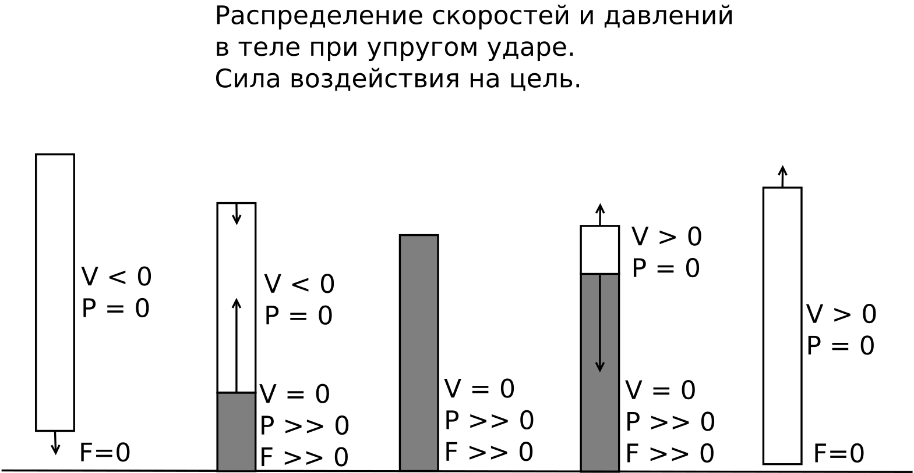

# Удар и волны

Ранее мы увидели, что сила удара может быть многократно больше силы толчка. Сила приводящая толчок равна силе самого толчка, а от чего зависит сила удара? Здесь нам понадобится поближе рассмотреть такое явление как упругие волны. Ранее мы рассматривали упругое соударение нескольких тел с полной передачей, теперь давайте посмотрим как это будет выглядеть если элементов будет ещё больше.

<video width="640" height="400" controls>
	<source src="../data/good-wave.mp4" type="video/mp4">
	Ваш браузер не поддерживает видео html5 в формате mp4
</video> 

Так происходит передача между множеством тел, но точно такие же процессы происходят при передаче движения внутри самого тела, когда все его элементы составляют единое целое. Иными словами, импульс и энергия внутри тел могут переносится посредством упругих и неупругих волн. Перед тем, как идти дальше, давайте посмотрим, как будет распросраняться волна в немного "испорченной" системе:

<video width="640" height="400" controls>
	<source src="../data/bad-wave.mp4" type="video/mp4">
	Ваш браузер не поддерживает видео html5 в формате mp4
</video> 

Это можно считать моделью зажима там, где его быть не должно: как видно, система распадается, а первоначальный импульс размазывается по нескольким её частям.

Теперь давайте более подробно рассмотрим что происходит внутри тела при ударе о твёрдое препятствие, для чего решим следующую задачу: стальной металлический стержень высотой в 1 метр и массой в 10 килограмм падает на абсолютно твёрдый пол. Что происходит, какова сила воздействия на опору?

Зная высоту падения мы можем через энергию определить скорость перед ударом, а значит и импульс падающего тела. После упругого контакта тело отскакивает, меняя свою скорость на противоположную, значит телу был сообщён импульс в два раза превосходящий по модулю тот, который был непосредственно перед контактом, но имеющий протовоположное ему направление. Этот импульс получен за счёт действия силы реакции опоры в течение определённого времени. Осталось понять, сколько времени длится удар.

Здесь V-скорость части тела в данной зоне, P-давление, F-сила давления на опору.

При контакте с полом возникает упругая волна сжатия, которая со скоростью звука поднимается по всему стержню, затем спускается вниз. Всё это время стержень с некой силой воздействует на опору. Напомним, что эта сила такова, что импульс тела за время удара меняет своё направление на противоположное.
Если решить эту задачу, то окажется, что время соударения равно ~400 микросекунд, а сила примерно равна 224000 Н для высоты падения в 1 метр, что примерно в 2240 раз больше веса стержня. А для случая падения с высоты в 3 метра, сила уже превышает статическую прочность стали. 

Аналогичные процессы происходят и при ударах руками, ногами и прочих частей тела. При этом, силы возникающие при ударах многократно больше тех, которые могут развить наши мышцы, то есть, хороший удар, это, скорее, правильно подведённая волна, нежели напряжение мышц в момент касания цели. Кроме того, правильный тонус машц позволяет распределять и гасить такие отражённые волны в теле, что даёт возможность минимизировать вред от отражённой волны.
